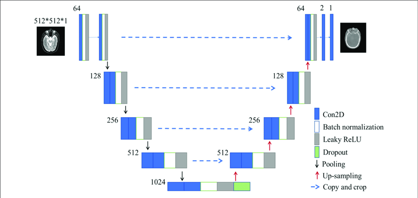
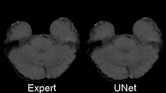
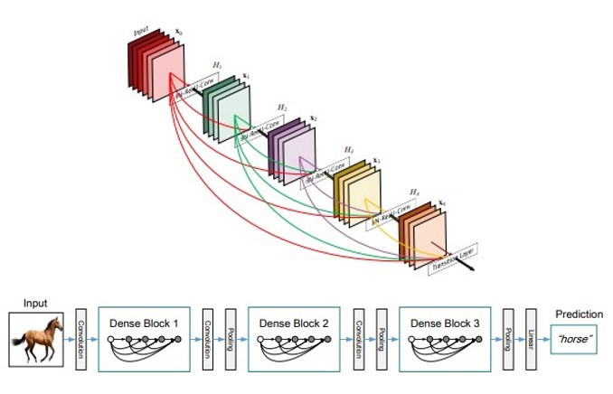

# uniMedic-Models

Los modelos de uniMedic son los módulos de PyTorch 🔥 que se utilizan actualmente en uniMedic-Core, entrenados en conjuntos de datos disponibles públicamente. Cada modelo tiene una breve explicación a continuación y un ejemplo de cómo hacer inferencias sobre el modelo. 

### Visual Question Answering ❓

Visual Question Answering es una tarea desafiante para el aprendizaje automático moderno. Requiere un sistema de inteligencia artificial que pueda comprender tanto el texto como el idioma, de modo que pueda responder preguntas basadas en texto dado el contexto visual (una imagen, una tomografía computarizada, una resonancia magnética, etc.).

Los investigadores están desarrollando continuamente muchos métodos sofisticados para VQA, como [Oscar](https://www.microsoft.com/en-us/research/publication/oscar-object-semantics-aligned-pre-training-for-vision-language-tasks/) ó [VL-BERT](https://www.microsoft.com/en-us/research/publication/vl-bert-pre-training-of-generic-visual-linguistic-representations/).

Los enfoques basados en redes neuronales normalmente requieren grandes cantidades de datos. Debido al hecho de que los datos médicos son escasos, desarrollar modelos neuronales para la medicina es mucho más difícil: los modelos deben ser precisos utilizando pequeñas cantidades de datos.

Nuestro motor VQA se basa en MedVQA, un modelo de vanguardia entrenado en imágenes y preguntas médicas, utilizando Meta-Learning y un Autoencoder convolucional para la extracción de representaciones, como se presenta [aquí](https://github.com/aioz-ai/MICCAI19-MedVQA/tree/c076f2cc174def26fa597fce4235b93f56658cc8).

A continuación se muestra la arquitectura del modelo VQA:

  

### Segmentación Cerebral Médica 🧠

La segmentación médica es la tarea de resaltar una región o un conjunto de regiones con una propiedad específica. Si bien esta tarea se resuelve principalmente en la configuración de propósito general, en la escena médica esta tarea es bastante difícil debido a la dificultad del problema, los humanos tienen una mayor tasa de error al resaltar anomalías en el cerebro y la falta de datos.

Nuestro modelo usa una arquitectura [UNet](https://arxiv.org/pdf/1505.04597.pdf), una red residual basada en downsampling y upsampling  que tiene un buen desempeño en la localización de diferentes características, como se presenta en PyTorch [hub](https://pytorch.org/hub/mateuszbuda_brain-segmentation-pytorch_unet/), gracias al trabajo de Mateusz Buda.

La imagen de entrada es una imagen de resonancia magnética cerebral de 3 canales, la salida es un mapa de probabilidad de un canal de regiones anormales, que luego se transforma en una máscara de segmentación binaria.

A continuación se muestra la arquitectura y una pequeña demostración de UNET en una tarea de segmentación cerebral:

  

  

### Etiquetado Médico 📝

El etiquetado médico es la tarea de elegir qué tipo de imagen el usuario está introduciendo en la aplicación, las posibles etiquetas son cerebro, pecho, mama, ojos, corazón, codo, antebrazo, mano, húmero, hombro, muñeca. Actualmente, nuestro modelo VQA tiene soporte solo para cerebro y pecho (toráx), pero estamos trabajando para agregar soporte a múltiples etiquetas.

Nuestro modelo utiliza una arquitectura Densenet121 disponible en módulo [torchvision](https://pytorch.org/docs/stable/torchvision/models.html), la arquitectura ha demostrado ser mejor en imágenes médicas por proyectos como [MONAI](https://github.com/Project-MONAI/MONAI) que lo usa ampliamente.

A continuación se muestra la arquitectura de Densenet121:

  

### Filtrado Médico 🚫

El filtrado médico es la tarea de etiquetar imágenes en dos conjuntos, médicos y no médicos, ya que queremos filtrar todos los no médicos para que no se incluyan en los otros modelos de aprendizaje automático.

Nuestro modelo utiliza la misma arquitectura Densenet121 del módulo [torchvision](https://pytorch.org/docs/stable/torchvision/models.html).

## Datasets ✔️

Los conjuntos de datos utilizados en este proyecto son una versión aumentada de:
* [VQA-RAD](https://www.nature.com/articles/sdata2018251#data-citations)
* [Tiny ImageNet](https://tiny-imagenet.herokuapp.com/)
* [Medical Decathlon](http://medicaldecathlon.com/)
* [Mednist](https://www.dropbox.com/s/5wwskxctvcxiuea/MedNIST.tar.gz) - el conjunto de datos está amablemente disponible por  [Dr. Bradley J. Erickson M.D., Ph.D.](https://www.mayo.edu/research/labs/radiology-informatics/overview) (Departamento de Radiología, Clínica Mayo) bajo licencia Creative Commons [CC BY-SA 4.0](https://creativecommons.org/licenses/by-sa/4.0/).
